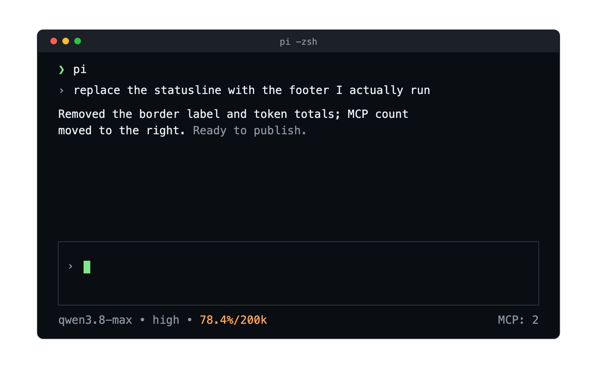

# @alexeyco/pi-statusline

Compact statusline for the [pi](https://pi.dev) coding agent — published as a pi extension package.

Relocates status information in the pi TUI:

- **Footer** — a single line: `model • thinking • ctx%/window` on the left,
  `MCP: n` right-aligned. The MCP count is read from `~/.pi/agent/mcp.json`
  and refreshes when MCP servers change. Context usage turns orange above
  70% and red above 90%.
- Extension statuses (`ctx.ui.setStatus`) keep their own line below.

<p align="center">
  
</p>

## Install

```sh
pi install npm:@alexeyco/pi-statusline
```

Requires pi ≥ 0.76 (peer dependencies are `*` and resolved by `pi install`).
The extension activates automatically on session start.

**Migrating from a local copy:** if you previously kept this extension in
`~/.pi/agent/extensions/status-layout/`, remove that directory after
installing the package — otherwise both copies register and fight over
the footer.

## Development

```sh
git clone https://github.com/alexeyco/pi-statusline
cd pi-statusline
pi install "$(pwd)"   # local install; edits are live
make test             # unit tests (node:test, needs Node ≥ 22.18)
make check            # sanity checks (same as CI)
```

See [CONTRIBUTING.md](CONTRIBUTING.md) for branching and release flow.
